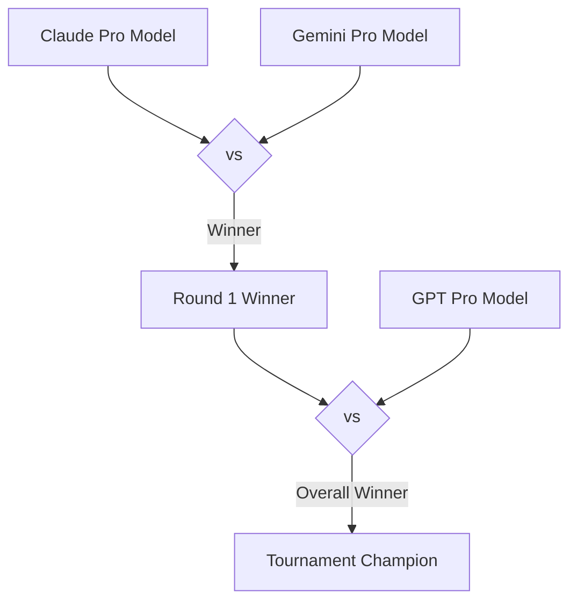

# Summarized Thoughts & Model Comparisons

This directory is used to aggregate challenge outputs and maintain summarized thoughts on how various Large Volume Models (LLMs) produce code. Over time, these records help build a collective opinion on model strengths, coding style, and performance characteristics.

## Tournament Methodology

To consistently compare top-tier models, we use a tournament-style matchup:



1. **Round 1 (Initial Pro Matchup)**: Compare two top-tier pro models (e.g., **Claude 3.7 Sonnet** vs. **Gemini 1.5 Pro**).
2. **Round 2 (Championship Matchup)**: Match the winner of Round 1 against the remaining top-tier pro model (e.g., **GPT-4o**).
3. **Synthesis**: Aggregate results from these comparisons across multiple challenges to draw wider conclusions.

---

## Tournament Tracking Log

Use the table below to track ongoing and completed tournament runs. Create a new markdown file for each tournament run using the [comparison-template.md](file:///Users/timothyco/Code/side-by-side-frontier/summarized-thoughts/comparison-template.md) file.

| Tournament ID | Challenge Scope | Round 1 (A vs B) | Round 2 (R1 Winner vs C) | Overall Winner | Notes / Link |
| :--- | :--- | :--- | :--- | :--- | :--- |
| `001` | *Async Event Loop* | Claude 3.7 Sonnet vs Gemini 1.5 Pro (Claude won) | Claude 3.7 Sonnet vs GPT-4o | Claude 3.7 Sonnet | [Details](file:///Users/timothyco/Code/side-by-side-frontier/summarized-thoughts/runs/001-example.md) |
| `002` | *Basic Fibonacci* | Claude 4.5 Haiku vs Gemini 3.5 Flash (Claude won) | Claude 4.5 Haiku vs GPT-4o | Claude 4.5 Haiku | Claude provided 5 distinct algorithms (including $O(\log n)$ matrix exponentiation) and a comparison table, though it missed negative input validation. Gemini 3.5 Flash was highly idiomatic but lacked breadth. GPT-4o was a standard single-solution. |
| `003` | *Basic Python Config Parser* | Claude 4.7 Opus vs Gemini 3.1 Pro (Claude won) | Claude 4.7 Opus vs GPT-5.5 | Claude 4.7 Opus | Claude gracefully skipped malformed lines and prevented empty keys. GPT-5.5 crashed on missing `=` and allowed empty keys. |
| `004` | *Intermediate IaC Node Security* | Claude 4.7 Opus vs Gemini 3.1 Pro (Claude won) | Claude 4.7 Opus vs GPT-5.5 | GPT-5.5 | GPT-5.5 won due to superior cloud architecture (encrypted Fargate Ephemeral Storage instead of high-latency EFS for `/tmp`) and clever distroless user-creation. Claude used EFS but missed VPC mount targets. Gemini missed EFS Access Point permissions entirely. |
| `005` | *Intermediate Python Moving Average* | Claude 4.7 Opus vs Gemini 3.1 Pro (Gemini won) | GPT-5.5 vs Gemini 3.1 Pro | GPT-5.5 | Gemini used idiomatic `collections.deque` over Claude's manual circular buffer. GPT-5.5 won overall by adding robust input validation to prevent `ZeroDivisionError`. |
| `006` | *Intermediate Python/JS Rules (SaaS Billing)* | Claude 4.7 Opus vs Gemini 3.1 Pro (Claude won) | Claude 4.7 Opus vs GPT-5.5 | GPT-5.5 | Claude wrote an excellent State Monad pipeline with integer cents. GPT-5.5 won by implementing exact rational arithmetic via `bigint` to eliminate rounding drift and using a State-Either Monad Transformer for error handling. |
| `007` | *Intermediate Python Ordered Transaction* | Claude 4.7 Opus vs Gemini 3.1 Pro (Claude won) | Claude 4.7 Opus vs GPT-5.5 | Claude 4.7 Opus | Claude won due to cleaner control flow, defensive batch-size validation, strict adherence to requested type signatures, and comprehensive test suites. |
| `008` | *Intermediate SQL Date Partition Logic* | Claude 4.7 Opus vs Gemini 3.1 Pro (Claude won) | Claude 4.7 Opus vs GPT-5.5 | Claude 4.7 Opus | Claude correctly handled timezone-aware timestamp parsing to UTC and robust geo-standardization. Gemini used buggy `ILIKE` filters. GPT-5.5 was severely over-engineered with a 100-line pure-SQL parser. |
| `009` | *Advanced Python Algo Refactor (Spatial)* | Claude 4.7 Opus vs Gemini 3.1 Pro (Claude won) | Claude 4.7 Opus vs GPT-5.5 | GPT-5.5 | Claude implemented a Skip List with `__slots__` but degraded to $O(N^2)$ in worst-case vertical distributions. Gemini suffered from exponential memory explosion and destructive in-place mutation. GPT-5.5 won with an augmented Interval Treap, generator-based streaming, and active memory clearing. |
| `010` | *Advanced Rust/Go Concurrency (Batch Processor)* | Claude 4.7 Opus vs Gemini 3.1 Pro (Gemini won) | GPT-5.5 vs Gemini 3.1 Pro | GPT-5.5 | Claude's Rust implementation deadlocked on shutdown due to cloned senders and recreated sleep futures inefficiently. Gemini 3.1 Pro was highly idiomatic with pinned timers and clean draining. GPT-5.5 (Go) won overall by using a read-write mutex to allow blocked producers to complete writes before closing, preventing any data loss. |
| `011` | *Advanced TS State Machine (Checkout)* | Claude 4.7 Opus vs Gemini 3.1 Pro (Claude won) | Claude 4.7 Opus vs GPT-5.5 | GPT-5.5 | Claude used a clean declarative transition table but required a `step` wrapper for compile-time errors. Gemini used unmaintainable nested ternaries and violated Redux architecture. GPT-5.5 won with direct generic constraints at the call site, Elm-style Command patterns for side effects, and robust rollback retry handling. |
| `012` | *Intermediate Python Error Recovery (Asyncio Lock)* | Claude 4.7 Opus vs Gemini 3.1 Pro (Gemini won) | GPT-5.5 vs Gemini 3.1 Pro | Gemini 3.1 Pro | Gemini won by using idiomatic `collections.defaultdict(asyncio.Lock)` and correctly identifying that synchronous dictionary operations are atomic in `asyncio`. Claude over-engineered with an unnecessary global lock guard. GPT-5.5 used a verbose manual helper function. Gemini also highlighted memory leak risks. |
| `013` | *Advanced C Custom Memory Allocator* | Claude 4.7 Opus vs Gemini 3.1 Pro (Claude won) | Claude 4.7 Opus vs GPT-5.5 | Claude 4.7 Opus | Claude used elegant sequential coalescing and type-safe inline helpers. Gemini used macro-heavy academic code with a suboptimal split threshold. GPT-5.5 made a critical architectural error by performing an $O(N)$ heap scan inside `free`, defeating boundary tags. |
| `014` | *Advanced C++ SPSC Ring Buffer* | Claude 4.7 Opus vs Gemini 3.1 Pro (Claude won) | Claude 4.7 Opus vs GPT-5.5 | Claude 4.7 Opus | Claude implemented a production-grade C++ container with placement `new`, explicit destructors, and trailing padding. Gemini used a naive array allocation that leaked moved-from objects. GPT-5.5 had a critical data-corruption bug when monotonic indices wrapped around on non-power-of-two capacities. |
| `015` | *Advanced Go Distributed Dual-Write* | Claude 4.7 Opus vs Gemini 3.1 Pro (Claude won) | Claude 4.7 Opus vs GPT-5.5 | GPT-5.5 | Claude avoided network I/O in DB transactions but lacked a visibility timeout, breaking horizontal scaling. GPT-5.5 won by implementing a robust `locked_until` visibility timeout, modern `pgx/v5` driver, and a fully realized Painless script for ES upserts. Gemini performed network I/O inside the DB transaction. |
| `016` | *Advanced Node.js Profile Update Controller* | Claude 4.7 Opus vs Gemini 3.1 Pro (Claude won) | Claude 4.7 Opus vs GPT-5.5 | Claude 4.7 Opus | Claude won both rounds by using industry-standard `Joi` validation, proper database transactions, and connection pool lifecycle management. Gemini used manual whitelisting and lacked transactions. GPT-5.5 wrote over 100 lines of risky, verbose custom validation and escaping helpers. |
| `017` | *Advanced Python Session Management* | Claude 4.7 Opus vs Gemini 3.1 Pro (Claude won) | Claude 4.7 Opus vs GPT-5.5 | GPT-5.5 | Claude used thread-safe `RLock` and active purging, but had redundant hashing. GPT-5.5 won with strict cryptographic constraints (min key size, entropy limits), pre-validation regex DoS protection, modern Python 3.10+ features (`slots=True`, `TypeGuard`), and robust import/header parsing. |

---

## Aggregate Opinions & Synthesis

*As we run more comparisons, aggregate the observations on model habits and trends here.*

### Claude (Anthropic)
- **Strengths**: 
  - **Educational & Comprehensive**: Often provides multiple algorithmic perspectives (e.g., recursive, iterative, and $O(\log n)$ matrix exponentiation for Fibonacci) along with detailed complexity tables.
  - **Robust Edge-Case Handling**: Consistently prevents empty keys in parsers, handles timezone-aware timestamp parsing to UTC, and implements robust geo-standardization lists rather than naive string matching.
  - **Functional Programming Mastery**: Excellent at implementing clean, composable monadic pipelines (e.g., State Monad), adhering to industry-standard financial practices like converting currency to integer cents early, and defining declarative type-safe state machines using lookup tables (`Transitions`) to map valid state/action pairs cleanly.
  - **Thorough Documentation & Testing**: Frequently includes edge-case matrices, detailed markdown tables, and comprehensive, runnable test suites.
  - **Elegant Data Structure & Low-Level Implementations**: Capable of writing complex structures from scratch (e.g., Skip Lists) using modern Python optimizations like `__slots__` to minimize object overhead. In C/C++, demonstrates exceptional low-level engineering, such as implementing custom memory allocators with elegant sequential coalescing (checking next then previous) and type-safe `static inline` helpers instead of macro-heavy academic code.
  - **Production-Grade Container Design**: Correctly manages generic object lifecycles in C++ using uninitialized memory, placement `new` on push, and explicit destructor calls (`~T()`) on pop, ensuring no default constructor is required and avoiding moved-from state leaks.
  - **Robust Concurrency & Thread Safety**: Implements thread-safe operations using `threading.RLock` in Python, and prevents false sharing in C++ by aligning pointers to cache line sizes (64 bytes) and adding trailing padding.
  - **Industry-Standard Web Patterns**: Integrates standard libraries like `Joi` for schema validation in Node.js, implements proper database transactions (`beginTransaction`, `commit`, `rollback`), and manages connection pool lifecycles (`getConnection`, `release`) cleanly.
- **Weaknesses**: 
  - **Suboptimal Infrastructure Choices**: Can occasionally propose architectural anti-patterns in IaC, such as using high-latency, network-attached AWS EFS for ephemeral `/tmp` scratch space.
  - **Minor Omissions & Overflow Vulnerabilities**: Can sometimes overlook basic input validation on simpler tasks or miss integer overflow checks in low-level pointer arithmetic (e.g., `align_up` wrapping around on extreme `size_t` values close to `SIZE_MAX`).
  - **Over-engineering & Async Misunderstandings**: May default to manual circular buffers or custom state tracking when highly optimized, native language utilities (like `collections.deque`) are more idiomatic. In single-threaded asynchronous environments (like Python's `asyncio`), it can over-engineer solutions by introducing unnecessary global locks around synchronous dictionary operations, creating execution bottlenecks.
  - **Algorithmic Edge-Case Degradation**: Can implement structures that fail to guarantee optimal complexity under specific distributions (e.g., a Skip List sorted only by `y1` degrading to $O(N^2)$ for vertical interval overlaps due to lack of interval tree augmentation).
  - **Concurrency Deadlocks & Scaling Flaws**: Prone to critical synchronization bugs in Rust, such as deadlocking on shutdown by cloning senders inside the processor, which prevents the receiver from detecting channel closure. In distributed systems, can fail to implement visibility timeouts (`locked_until`) for transactional outbox workers, causing horizontal scaling to break when processing times exceed polling intervals.
  - **Inefficient Timer Management**: Recreates sleep futures on every iteration of a select loop rather than pinning and resetting a single timer.
  - **Type-Safety Workarounds**: Sometimes relies on secondary wrapper functions (like a `step` helper) to enforce compile-time constraints on arguments rather than constraining the primary function signature directly.
  - **Redundant Operations**: Sometimes introduces redundant cryptographic hashing or validation checks (e.g., re-hashing a token for verification when the lookup key is already the secure hash).
  - **Minor Truncations & Standard Compliance**: Occasionally uses newer standards than requested (e.g., C++17 `std::aligned_alloc` when C++11 was specified) and can suffer from minor output truncations at the very end of long demo scripts.

### Gemini (Google)
- **Strengths**: 
  - **Highly Idiomatic Code**: Excellent at leveraging native language features and standard library utilities (e.g., using `collections.deque` for sliding windows, `@lru_cache` for memoization, `splitlines()` for cross-platform newlines, and `collections.defaultdict(asyncio.Lock)` for lock striping).
  - **Clean & Concise**: Focuses on delivering a single, practical, and readable implementation without unnecessary boilerplate.
  - **Deep Async & Concurrency Understanding**: Demonstrates a flawless understanding of cooperative multitasking and single-threaded event loops (e.g., correctly identifying that synchronous dictionary operations in Python `asyncio` are atomic and don't need meta-locks). In Rust, correctly pins and resets timers (`tokio::pin!` and `.reset()`) and implements clean, deadlock-free graceful shutdowns by consuming `self` and draining channels.
  - **Production-Level Memory Awareness**: Explicitly warns about memory leaks in long-running systems when dynamically creating locks, suggesting cleanup strategies like `weakref.WeakValueDictionary`.
- **Weaknesses**: 
  - **Critical Logical & Algorithmic Flaws**: Prone to dangerous SQL anti-patterns (e.g., using `ILIKE '%US%'` for geo-standardization, which incorrectly matches "Belarus" or "Cyprus") and severe memory-explosion bugs (e.g., duplicating overlapping intervals down to leaf levels in a custom Region Tree, causing exponential $2^{21}$ node duplication and OOM crashes).
  - **Destructive Side-Effects**: Can write library functions that destructively mutate caller input data in-place (e.g., replacing input list elements with `None` or tuples).
  - **IaC Permission Traps**: Misses critical runtime permissions in cloud configurations, such as failing to configure EFS Access Points for non-root containers, leading to "Permission Denied" errors.
  - **Lacks Depth & Outdated Academic Style**: Often omits advanced algorithms, comprehensive edge-case handling, or robust input validation compared to Claude and GPT. Frequently defaults to outdated, macro-heavy academic styles (e.g., CS:APP malloc lab macros) that lack type safety and are hard to debug. Can implement suboptimal splitting thresholds in allocators, allowing useless 0-payload blocks.
  - **Naive Container Design**: In C++, may write naive containers that force default constructors, leak moved-from objects in buffers, and introduce destructor overhead by destroying uninitialized elements.
  - **Critical Distributed Anti-Patterns**: Performs high-latency network I/O (e.g., Elasticsearch HTTP requests) inside active database transactions, risking connection pool exhaustion. Generates non-deterministic idempotency keys (e.g., random UUIDs on client retries), defeating database unique constraints.
  - **Architectural Violations**: Violates established patterns like Redux by forcing side-effect handlers to pass state into `dispatch` and return the next state, breaking standard unidirectional data flow.
  - **Unmaintainable Type Systems**: Uses deeply nested conditional types (ternary operators) for state transitions, which quickly becomes unreadable and error-prone compared to declarative lookup tables.
  - **Generation Failures**: Occasionally outputs only a planning process/thought-chain instead of the actual requested code.

### GPT (OpenAI)
- **Strengths**: 
  - **Architectural Precision (GPT-5.5)**: Demonstrates deep, principal-level engineering in cloud architecture (e.g., utilizing encrypted Fargate Ephemeral Storage for `/tmp` instead of EFS, and solving distroless user-creation by copying `/etc/passwd` from a builder stage).
  - **Mathematical & Algorithmic Rigor**: Implements exact rational arithmetic (using `bigint` numerators/denominators) to eliminate intermediate rounding drift in financial calculations. Implements mathematically optimal, fully augmented data structures (e.g., an augmented Interval Treap with deterministic pseudo-random priorities via splitmix64-style hashing) to guarantee true $O(N \log N + K)$ complexity.
  - **Advanced Functional Patterns**: Combines State Monads with Either/Result Monads (State-Either Monad Transformers) to handle monadic error propagation and short-circuiting elegantly. Employs the Elm Architecture / Command Pattern (returning `{ state, commands }` from reducers) for deterministic, highly testable side-effect management.
  - **Defensive Programming & Memory Optimization**: Consistently validates inputs (e.g., checking for `window_size <= 0` to prevent `ZeroDivisionError` or enforcing SHA256 image pinning via Terraform validation). Leverages generator-based streaming APIs (`iter_intersections`) and actively clears processed elements (`materialized[pos] = None`) during sweeps to minimize memory footprint and enable immediate garbage collection.
  - **Masterful Concurrency Patterns (Go)**: Solves complex shutdown races by combining `sync.RWMutex` with bounded channels, allowing blocked producers to complete their writes before closing the channel, preventing any data loss.
  - **Elegant Type Constraints**: Constrains generic arguments directly on the primary function signature (e.g., `A extends AllowedAction<S>`) to trigger immediate compile-time errors at the call site without needing wrapper functions.
  - **Robust Error Recovery & Distributed Design**: Models real-world failure modes, such as handling rollback failures and retries (`ROLLBACK_SWEEP_FAILED`, `RETRY_ROLLBACK_SWEEP`) and tracking unique IDs to prevent race conditions. Correctly implements visibility timeouts (`locked_until`) for transactional outbox workers to enable safe horizontal scaling. Provides fully realized, robust Elasticsearch Painless scripts for scripted upserts that handle out-of-order events and maintain processed idempotency keys.
  - **Strict Cryptographic & Security Constraints**: Enforces strict cryptographic key-length constraints (e.g., minimum 32-byte keys), token entropy limits, and pre-validates token shapes using regex-based TypeGuards to mitigate DoS vectors.
  - **Modern Language Features**: Leverages modern Python 3.10+ syntax, `slots=True` on dataclasses for memory efficiency, and `try/except ImportError` for resilient relative/direct imports.
- **Weaknesses**: 
  - **Severe Over-engineering & Custom Helpers**: Can write highly complex, unmaintainable code (e.g., a 100-line pure-SQL ISO-8601 parser and validator) that introduces massive performance overhead. Tends to reinvent the wheel by writing custom validation helpers and manual SQL identifier escaping in controllers instead of using industry-standard libraries like `Joi` or `Zod`, leading to massive boilerplate and potential security risks.
  - **Critical Algorithmic & Concurrency Bugs**: Can introduce severe bugs in lock-free algorithms, such as using monotonic sequence counters with modulo arithmetic on arbitrary capacities, leading to silent data corruption upon integer wrap-around on non-power-of-two capacities.
  - **Critical Architectural Mistakes**: Can make critical architectural mistakes that defeat the purpose of optimized data structures, such as performing an $O(N)$ linear heap scan inside an $O(1)$ boundary-tag `free` function to validate pointers.
  - **Strictness over Grace**: May raise unexpected exceptions (like crashing on malformed config lines) rather than gracefully skipping them, and can occasionally allow empty keys in parsers.
  - **Verbose Helpers**: Can occasionally default to manual, verbose helper functions (e.g., custom lock-retrieval helpers) instead of leveraging highly idiomatic standard library structures like `collections.defaultdict`.
  - **Rust Shutdown Edge Cases**: In Rust, may immediately close channels on shutdown, which is standard but less graceful than its Go implementation as it aborts blocked producers with a `SendError` rather than letting them drain.
  - **Pragmatic but Basic (GPT-4o)**: Standard models can sometimes default to single-solution boilerplate with fewer architectural details compared to Claude's thorough breakdowns.
```